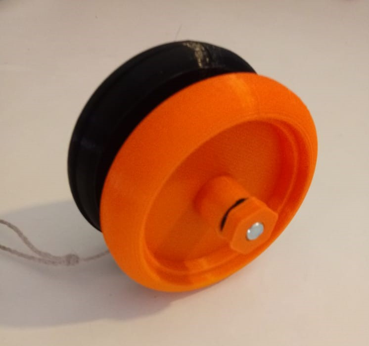

# Yoyo-3D

Projeto para criação de Yoyo na Impressora 3D

Projeto para a Impressora Creality Ender-3

Software de usado Ultimaker Cura 4.8.0

O projeto foi baseado no https://www.3dforprint.com/3dmodel/bearing-yoyo/3681

